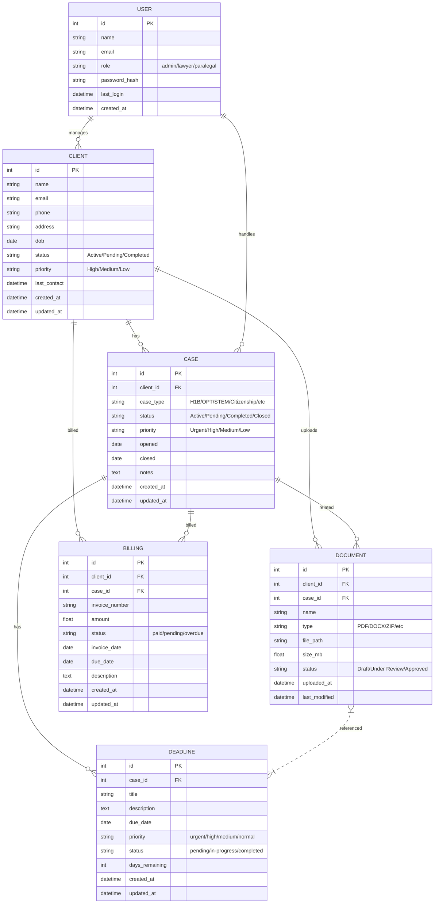

# Immigration Law Dashboard: Database ERD & API Roadmap

## Entity Relationship Diagram (ERD)

## API Roadmap

### Authentication APIs
- `POST /api/auth/login` — User login
- `POST /api/auth/logout` — User logout
- `GET /api/auth/me` — Get current user info
- `POST /api/auth/refresh` — Refresh auth token

### Client APIs
- `GET /api/clients` — List all clients (with filters: status, priority, search)
- `POST /api/clients` — Add a new client
- `GET /api/clients/:id` — Get client details
- `PUT /api/clients/:id` — Update client info
- `DELETE /api/clients/:id` — Remove a client
- `GET /api/clients/:id/cases` — Get all cases for a client
- `GET /api/clients/:id/documents` — Get all documents for a client
- `GET /api/clients/:id/billing` — Get billing history for a client

### Case APIs
- `GET /api/cases` — List all cases (with filters: status, case_type, priority)
- `POST /api/cases` — Add a new case
- `GET /api/cases/:id` — Get case details
- `PUT /api/cases/:id` — Update case info
- `DELETE /api/cases/:id` — Remove a case
- `GET /api/cases/:id/deadlines` — Get deadlines for a case
- `GET /api/cases/:id/documents` — Get documents for a case

### Document APIs
- `GET /api/documents` — List documents (with filters: type, status, case_type)
- `POST /api/documents` — Upload document
- `GET /api/documents/:id` — Get document details
- `GET /api/documents/:id/download` — Download document file
- `PUT /api/documents/:id` — Update document metadata
- `DELETE /api/documents/:id` — Remove document

### Deadline APIs
- `GET /api/deadlines` — List deadlines (with filters: priority, status, date_range)
- `POST /api/deadlines` — Add deadline
- `GET /api/deadlines/:id` — Get deadline details
- `PUT /api/deadlines/:id` — Update deadline
- `DELETE /api/deadlines/:id` — Remove deadline
- `PUT /api/deadlines/:id/complete` — Mark deadline as completed

### Billing APIs
- `GET /api/billing` — List billing records (with filters: status, client, date_range)
- `POST /api/billing` — Create invoice
- `GET /api/billing/:id` — Get invoice details
- `PUT /api/billing/:id` — Update invoice
- `DELETE /api/billing/:id` — Remove invoice
- `POST /api/billing/:id/send` — Send invoice to client
- `PUT /api/billing/:id/payment` — Record payment

### Analytics APIs
- `GET /api/analytics/dashboard` — Get dashboard statistics
- `GET /api/analytics/revenue` — Get revenue analytics
- `GET /api/analytics/cases` — Get case analytics by type/status
- `GET /api/analytics/deadlines` — Get deadline performance metrics
- `GET /api/analytics/clients` — Get client acquisition/retention metrics

### Notification APIs
- `GET /api/notifications` — Get user notifications
- `POST /api/notifications/mark-read` — Mark notifications as read
- `DELETE /api/notifications/:id` — Remove notification

---

## Implementation Roadmap

### Phase 1: Core Backend Setup
1. **Database Schema Creation** — Set up PostgreSQL/MySQL with tables per ERD
2. **Authentication System** — JWT-based auth with role management
3. **Basic CRUD APIs** — Implement core APIs for clients, cases, documents
4. **File Upload System** — Document storage with cloud integration (AWS S3/Azure Blob)

### Phase 2: Business Logic & Advanced Features
5. **Deadline Management** — Automated notifications and priority handling
6. **Billing System** — Invoice generation and payment tracking
7. **Search & Filtering** — Full-text search across all entities
8. **Data Validation** — Input validation and business rule enforcement

### Phase 3: Analytics & Reporting
9. **Dashboard Analytics** — Real-time statistics and KPI tracking
10. **Reporting System** — Generate case reports, billing summaries
11. **Notification System** — Email/SMS alerts for deadlines and updates
12. **Audit Logging** — Track all user actions and data changes

### Phase 4: Integration & Optimization
13. **Frontend Integration** — Connect React app to backend APIs
14. **Performance Optimization** — Database indexing, query optimization
15. **Security Hardening** — Rate limiting, input sanitization, HTTPS
16. **Deployment & CI/CD** — Production deployment with automated testing

### Tech Stack Recommendations
- **Backend**: Node.js/Express or Python/FastAPI
- **Database**: PostgreSQL with Redis for caching
- **File Storage**: AWS S3 or Azure Blob Storage
- **Authentication**: JWT with refresh tokens
- **API Documentation**: OpenAPI/Swagger
- **Testing**: Jest/Pytest with automated test suites
- **Monitoring**: Application logging and health checks
